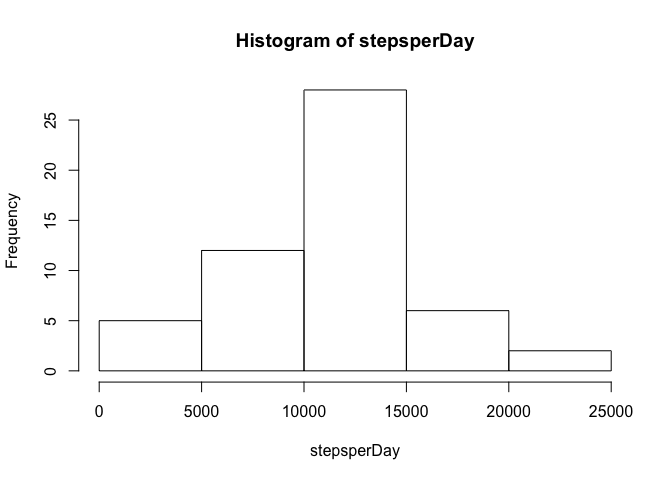
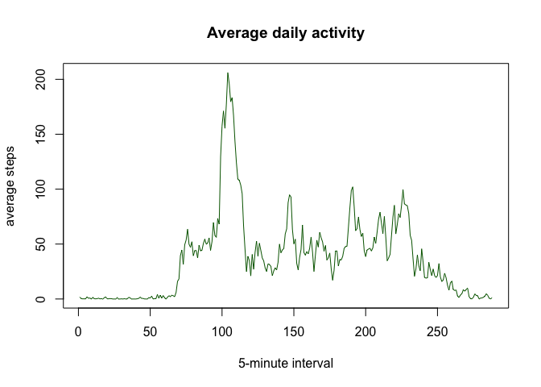
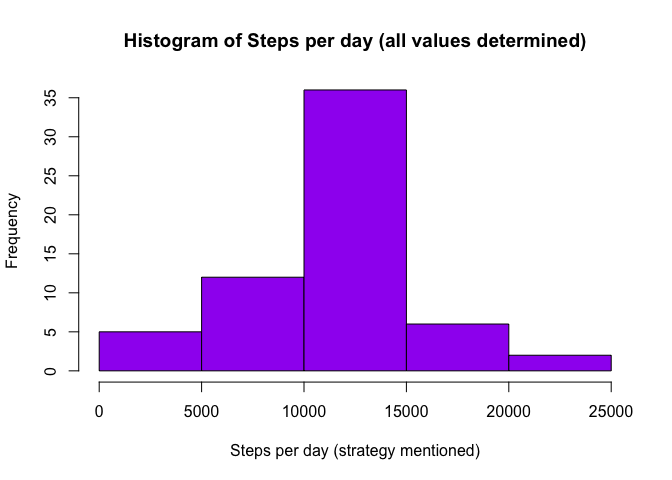
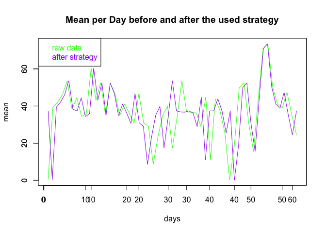
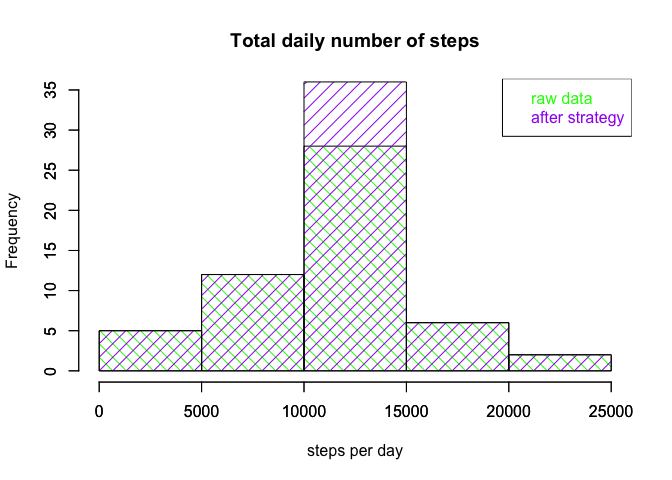
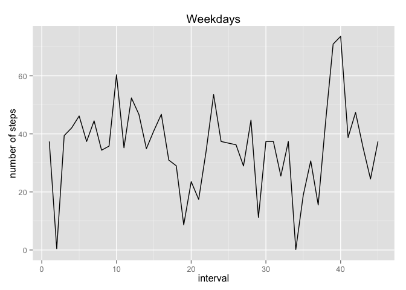
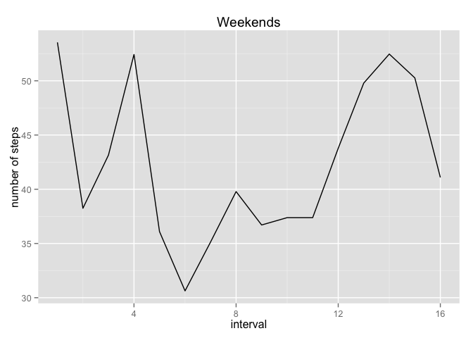

# Reproducible Research: Peer Assessment 1


## Loading and preprocessing the data

```r
dat <- read.csv("./activity.csv")
```

To ignore the missing values in the dataset


```r
noNA<-dat[complete.cases(dat),]
```

## What is mean total number of steps taken per day?
A histogram of the total number of steps taken each day. 

The function tapply() is used to  calculate the total number of steps the first day, the second day,...

```r
stepsperDay<-tapply(noNA$steps, as.Date(noNA$date), sum)
hist(stepsperDay)
```

 


Now we calculate the mean and median total number of steps taken per day

tapply() is used again to calculate the mean of the first day, the second,....


```r
meanperDay<-tapply(noNA$steps, as.Date(noNA$date), mean)
head(meanperDay)
```

```
## 2012-10-02 2012-10-03 2012-10-04 2012-10-05 2012-10-06 2012-10-07 
##     0.4375    39.4167    42.0694    46.1597    53.5417    38.2465
```

The median is calculated in the same way


```r
medianperDay<-tapply(noNA$steps, as.Date(noNA$date), median)
head(medianperDay)
```

```
## 2012-10-02 2012-10-03 2012-10-04 2012-10-05 2012-10-06 2012-10-07 
##          0          0          0          0          0          0
```


## What is the average daily activity pattern?
Make a time series plot (i.e. type = "l") of the 5-minute interval (x-axis) and the average number of steps taken, averaged across all days (y-axis)


```r
plot(tapply(noNA$steps, noNA$interval, mean), type="l", xlab="5-minute interval", ylab="average steps", main="Average daily activity", col ="darkgreen")
```

 
Which 5-minute interval, on average across all the days in the dataset, contains the maximum number of steps?

```r
max(tapply(noNA$steps, noNA$interval, mean))
```

```
## [1] 206.2
```
## Imputing missing values


    Calculate and report the total number of missing values in the dataset (i.e. the total number of rows with NAs)
    

```r
nrow(dat)-nrow(noNA)
```

```
## [1] 2304
```

    Devise a strategy for filling in all of the missing values in the dataset. 
    I have decided to fill in with the mean of all the means
    

    Create a new dataset that is equal to the original dataset but with the missing data filled in.
        

```r
strategy <- dat
strategy$steps[is.na(strategy$steps)]=mean(meanperDay)
strategy$date=as.Date(strategy$date)
```

    Make a histogram of the total number of steps taken each day and calculate and report the mean and median total number of steps taken per day. 


```r
stepsperDayStr<-tapply(strategy$steps, strategy$date, sum)
hist(stepsperDayStr, xlab="Steps per day (strategy mentioned)", main="Histogram of Steps per day (all values determined)", col="purple")
```

 

```r
meanperDayStr<-tapply(strategy$steps, strategy$date, mean)
head(meanperDayStr)
```

```
## 2012-10-01 2012-10-02 2012-10-03 2012-10-04 2012-10-05 2012-10-06 
##    37.3826     0.4375    39.4167    42.0694    46.1597    53.5417
```

```r
medianperDayStr<-tapply(strategy$steps, strategy$date, median)
head(medianperDayStr)
```

```
## 2012-10-01 2012-10-02 2012-10-03 2012-10-04 2012-10-05 2012-10-06 
##      37.38       0.00       0.00       0.00       0.00       0.00
```
Do these values differ from the estimates from the first part of the assignment? 


```r
plot(meanperDay,col="green", type="l",ylab="mean", xlab="days")
par(new=TRUE)
plot(meanperDayStr,col="purple", type="l", xlab="",ylab="")
title(main="Mean per Day before and after the used strategy")
legend("topleft", legend=c("raw data", "after strategy"), text.col = c("green", "purple"))
```

 


What is the impact of imputing missing data on the estimates of the total daily number of steps?


```r
h1 <- hist(stepsperDay, plot=FALSE)
h2 <- hist(stepsperDayStr, plot=FALSE)
plot(h1,col="green", ylim=c(0,35),density=10,angle=135,xlab="",ylab="",main="")
par(new=TRUE)
plot(h2, col="purple", ylim=c(0,35),density=10,angle=45,xlab="steps per day",ylab="Frequency",main="")
title(main="Total daily number of steps")
legend("topright", legend=c("raw data", "after strategy"), text.col = c("green", "purple"))
```

 


## Are there differences in activity patterns between weekdays and weekends?

Create a new factor variable in the dataset with two levels -- "weekday" and "weekend" indicating whether a given date is a weekday or weekend day.

```r
weekends <- strategy[weekdays(strategy$date) =="Sunday"|weekdays(strategy$date) =="Saturday",]
weekdays <- strategy[!(weekdays(strategy$date) =="Sunday"|weekdays(strategy$date) =="Saturday"),]
```

    Make a panel plot containing a time series plot (i.e. type = "l") of the 5-minute interval (x-axis) and the average number of steps taken, averaged across all weekday days or weekend days (y-axis). 

```r
    meanWeekends <-tapply(weekends$steps, weekends$date, mean)
    meanWeekdays <-tapply(weekdays$steps, weekdays$date, mean)
library(ggplot2)

qday <- qplot(1: length(meanWeekdays), meanWeekdays, geom="line")+labs(title="Weekdays")+labs(x="interval", y="number of steps")

 qend <- qplot(1: length(meanWeekends), meanWeekends,  geom="line")+labs(title="Weekends")+labs(x="interval", y="number of steps")
print(qday);print(qend)
```

  
